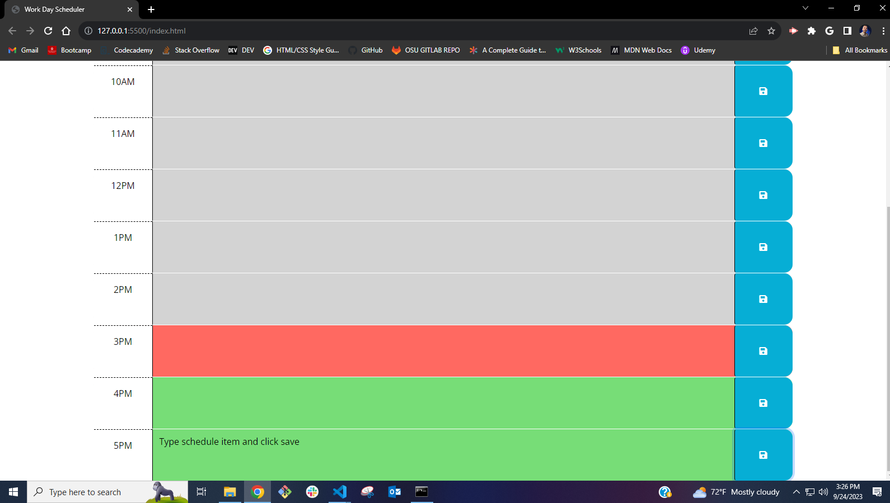
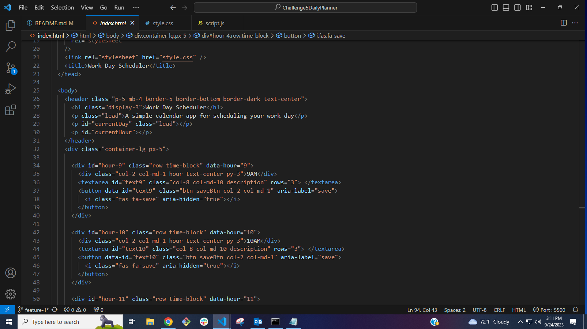
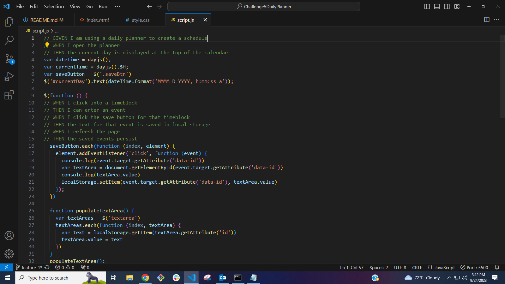
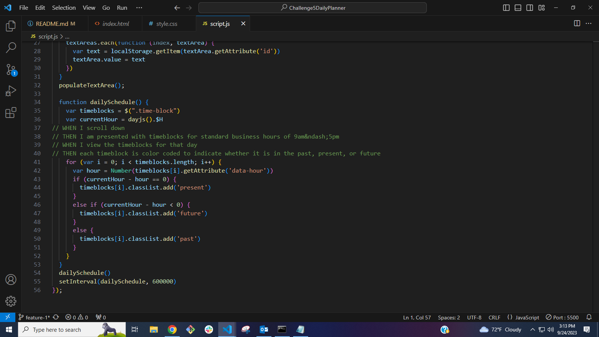
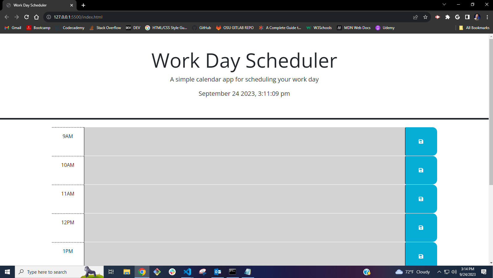
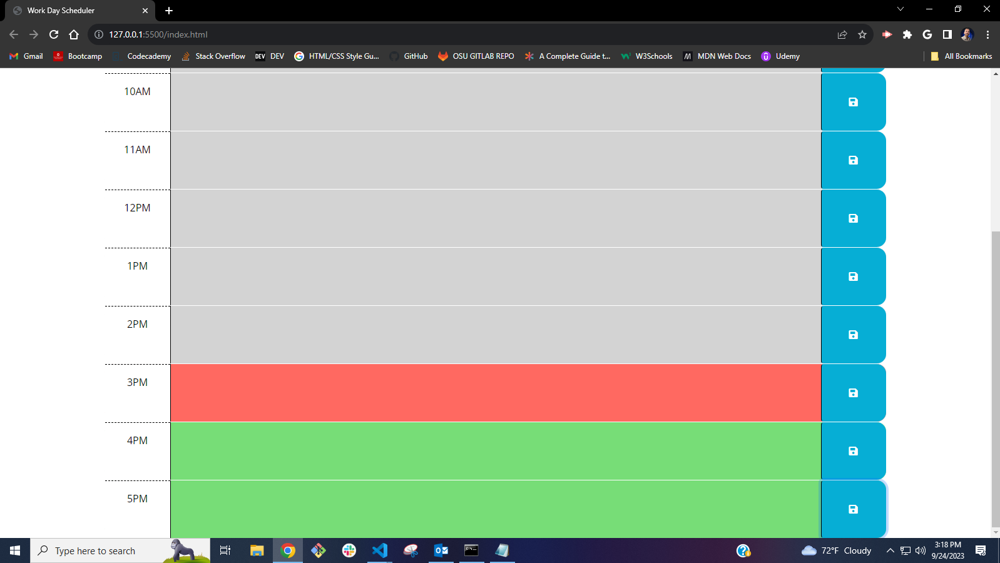
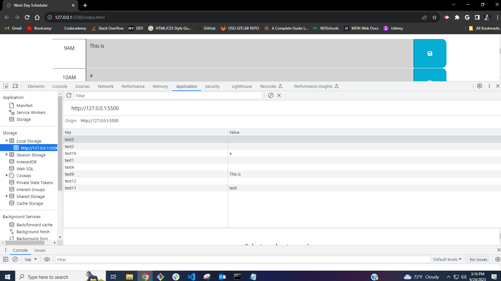

# Challenge5DailyPlanner
Challenge5ScheduleOrganizer

## Description
Work day schedule organizer

## Usage

Find the hour block that you need to put a new schedule item in, and type it into that field. Then click the blue save button next to it.

After clicking save then no matter if you refresh, the schedule item remains in the time block.

## Coding

## Site pages
https://marrasmith.github.io/Challenge5DailyPlanner/
https://github.com/MArrasmith/Challenge5DailyPlanner/

## License

Copyright (c) 2023 Michael Arrasmith

Permission is hereby granted, free of charge, to any person obtaining a copy
of this software and associated documentation files (the "Software"), to deal
in the Software without restriction, including without limitation the rights
to use, copy, modify, merge, publish, distribute, sublicense, and/or sell
copies of the Software, and to permit persons to whom the Software is
furnished to do so, subject to the following conditions:

The above copyright notice and this permission notice shall be included in all
copies or substantial portions of the Software.

THE SOFTWARE IS PROVIDED "AS IS", WITHOUT WARRANTY OF ANY KIND, EXPRESS OR
IMPLIED, INCLUDING BUT NOT LIMITED TO THE WARRANTIES OF MERCHANTABILITY,
FITNESS FOR A PARTICULAR PURPOSE AND NONINFRINGEMENT. IN NO EVENT SHALL THE
AUTHORS OR COPYRIGHT HOLDERS BE LIABLE FOR ANY CLAIM, DAMAGES OR OTHER
LIABILITY, WHETHER IN AN ACTION OF CONTRACT, TORT OR OTHERWISE, ARISING FROM,
OUT OF OR IN CONNECTION WITH THE SOFTWARE OR THE USE OR OTHER DEALINGS IN THE
SOFTWARE.
